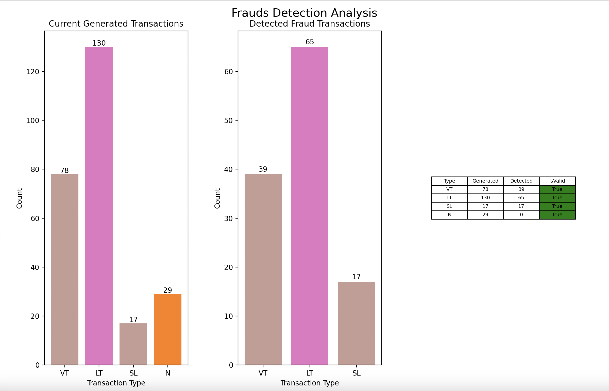

# Transaction generator and frauds detector system (kafka + flink)

## System architecture


System is working correctly on `MacOS v14.5 Soma` on M1.

## Frauds Detector flink job


## Transactions monitoring



## Requirements:

- Kafka: 3.7.0
- Flink: 1.19.0
- JAVA SDK: v11.X (flink), v8.X (kafka)
- Kafdrop: 3.29.0
- MAVEN: 3.9.6
- IntelliJ IDE

## How to setup system step by step

Setup env variables in the `infrastructure/.env` file:

```yaml
KAFKA_DIR=  directory where kafka is installed
FLINK_DIR=directory where flink is installed
KAFKA_LOG_DIR=./~
JAVA_11_BIN_PATH= path to the java 11 sdk bin file
KAFDROP_PATH= path to kafdrop jar file
```

1. Start kafka & zookeeper cluster

```bash
infrastructure/scripts/kafka-setup.sh
```

Sometimes there is a problem with racing between threads which starts kafka and kafdrop, in this situation stop the process and start one more time

2. Start flink cluster

```bash
infrastructure/scripts/flink-run.sh
```

3. Verify is everything working correctly:

- Open kafdrop to verify is kafka working properly: `localhost:9000`
- Open flink interface: `localhost:8081`

4. Build java Fraud Detector app

- the best way is to use IntelijIDE and use maven `package` build option

5. Submit flink job

```bash
flink run <frauds-detector>.jar
```

6. Prepare python environment:

```bash
./transactions-generator/setup-env.sh
```

7. Run generator:

```bash
python transactions-generator/src/main.py
```

8. Run transactions analyzer

```bash
python  transaction-generator/src/analyzer/analyzer.py
```

9. After working with the system cleanup all:

```bash
./infrastructure/scripts/cleanup.sh
```
